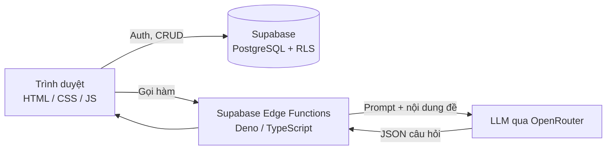

<div align="center">

# ⚛️ Physics Exam Web

**Nền tảng luyện đề Vật lí THPT trực tuyến — làm bài có tính giờ, chấm điểm tự động, quản lý kết quả theo tài khoản, và trích xuất đề thi bằng AI.**


</div>

---

## 📖 Giới thiệu

**Physics Exam Web** là ứng dụng web giúp học sinh luyện đề Vật lí theo cấu trúc đề thi THPT mới (trắc nghiệm nhiều lựa chọn, đúng/sai, trả lời ngắn). Giáo viên có thể xây dựng kho đề, xuất bản đề và theo dõi bảng điểm của toàn bộ học sinh. Hệ thống tích hợp **AI** để tự động trích xuất câu hỏi từ nội dung đề thi, giúp giảm đáng kể thời gian soạn đề thủ công.

## ✨ Tính năng chính

### 👨‍🎓 Dành cho học sinh
- Đăng ký / đăng nhập bằng email, lưu hồ sơ **họ tên và lớp**.
- Duyệt **kho đề** đã được giáo viên xuất bản.
- Làm bài **có đồng hồ đếm ngược** theo thời lượng từng đề.
- Hỗ trợ **3 dạng câu hỏi**: trắc nghiệm (MCQ), đúng/sai, trả lời ngắn.
- **Chấm điểm tự động** và lưu lịch sử kết quả cá nhân.
- Giao diện **responsive** cho cả máy tính và điện thoại.

### 👩‍🏫 Dành cho giáo viên
- Khu vực đăng nhập riêng, phân quyền ở tầng cơ sở dữ liệu.
- Tạo, chỉnh sửa, xuất bản / ẩn đề thi trong kho đề.
- Xem **toàn bộ bảng điểm** của học sinh.
- **Trích xuất câu hỏi bằng AI** từ nội dung đề và **phân tích trang đề** để chuẩn hoá dữ liệu.

### 🔒 Bảo mật & toàn vẹn dữ liệu
- **Supabase Auth** quản lý xác thực.
- **Row Level Security (RLS)**: học sinh chỉ đọc lịch sử của mình, giáo viên đọc toàn bộ.
- Mỗi kết quả được gắn với `student_user_id` của đúng tài khoản nộp bài.
- Ràng buộc `CHECK` ở CSDL đảm bảo đề xuất bản đúng cấu trúc.

## 🏗️ Kiến trúc



## 🧰 Công nghệ sử dụng

| Lớp | Công nghệ |
|---|---|
| Frontend | HTML5, CSS3, JavaScript (Vanilla) |
| Backend / BaaS | Supabase (Auth, PostgreSQL, Row Level Security) |
| Serverless | Supabase Edge Functions (Deno, TypeScript) |
| AI | LLM thông qua OpenRouter API |
| CSDL | PostgreSQL / PL-pgSQL (hàm, trigger, policy) |

## 📁 Cấu trúc thư mục

```text
physics_exam_web/
├── index.html                  # Giao diện chính (đăng nhập, kho đề, làm bài)
├── styles.css                  # Giao diện responsive
├── app.js                      # Logic chính: Auth, phân quyền, làm bài, chấm điểm
├── data.js                     # Dữ liệu đề mẫu
├── supabase-config.js          # Cấu hình kết nối Supabase
├── supabase_exam_library.sql   # Schema kho đề + quyền giáo viên
├── student_auth_upgrade.sql    # Migration: hồ sơ học sinh + RLS
└── Edge Funtion/
    ├── analyze-physics-page/   # Edge Function phân tích trang đề
    └── extract-exam-questions/ # Edge Function trích xuất câu hỏi bằng AI
```

## 🚀 Cài đặt & chạy

### 1. Clone dự án
```bash
git clone https://github.com/vbaoF12/physics_exam_web.git
cd physics_exam_web
```

### 2. Thiết lập Supabase
1. Tạo project tại [supabase.com](https://supabase.com).
2. Vào **SQL Editor** và chạy lần lượt:
   - `supabase_exam_library.sql` — tạo bảng `exams` và hàm phân quyền giáo viên.
   - `student_auth_upgrade.sql` — tạo `student_profiles`, trigger và các RLS policy.
3. Vào **Authentication → Providers → Email**: bật email/password và cho phép đăng ký mới.
4. Thêm email giáo viên vào hàm `is_exam_teacher()` trong file SQL.

### 3. Cấu hình kết nối
Cập nhật `supabase-config.js` bằng **Project URL** và **anon key** của bạn:
```js
window.SUPABASE_URL = "https://<project-id>.supabase.co";
window.SUPABASE_ANON_KEY = "<your-anon-key>";
```
> Tên biến thực tế có thể khác — hãy giữ đúng theo file hiện có.

### 4. Triển khai Edge Functions (tuỳ chọn, cho tính năng AI)
```bash
supabase functions deploy extract-exam-questions
supabase functions deploy analyze-physics-page
supabase secrets set OPENROUTER_API_KEY=<your-key>
```

### 5. Chạy ứng dụng
Đây là web tĩnh, chỉ cần mở bằng một static server:
```bash
npx serve .
```
Hoặc dùng extension **Live Server** trong VS Code.

## 🔄 Luồng sử dụng

1. Học sinh mở website → đăng nhập hoặc tạo tài khoản.
2. Hệ thống tải hồ sơ (họ tên, lớp) → mở kho đề.
3. Chọn đề → làm bài trong thời gian quy định.
4. Nộp bài → nhận điểm ngay, kết quả lưu theo tài khoản.
5. Giáo viên xem bảng điểm và quản lý kho đề trong khu vực riêng.

## 🗺️ Hướng phát triển

- [ ] Thống kê tiến bộ và biểu đồ điểm theo thời gian.
- [ ] Xếp hạng, huy hiệu để tăng động lực học tập.
- [ ] Giải thích đáp án chi tiết bằng AI.
- [ ] Hỗ trợ công thức LaTeX và hình vẽ trong câu hỏi.
- [ ] Xuất bảng điểm ra Excel / PDF.

## 🤝 Đóng góp

Mọi đóng góp đều được hoan nghênh. Hãy fork repo, tạo nhánh mới (`feature/ten-tinh-nang`), commit và mở Pull Request.

## 📬 Liên hệ

**vbaoF12** — [GitHub](https://github.com/vbaoF12)

---

<div align="center">⭐ Nếu thấy dự án hữu ích, hãy tặng một ngôi sao cho repo nhé!</div>
